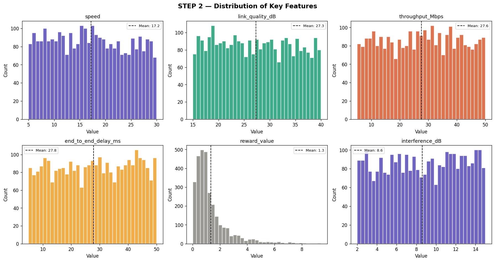
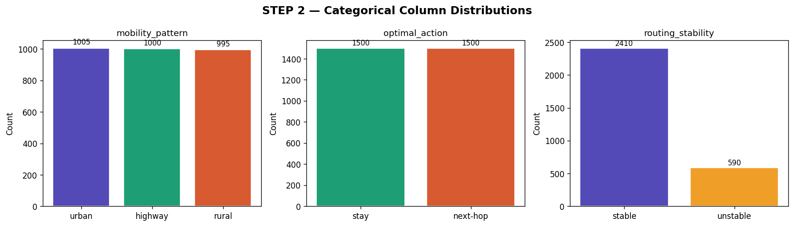
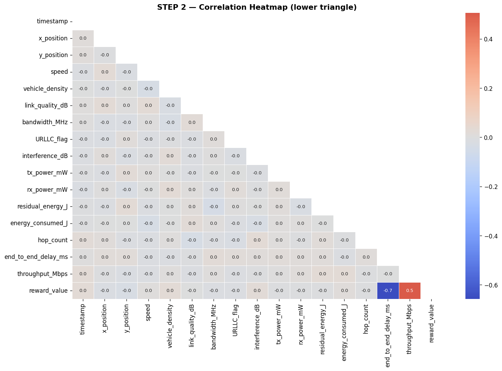
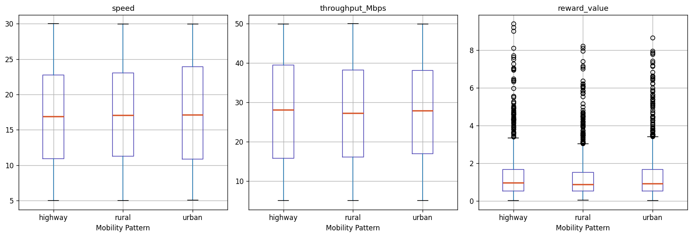
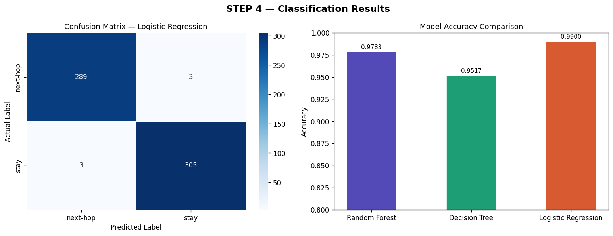
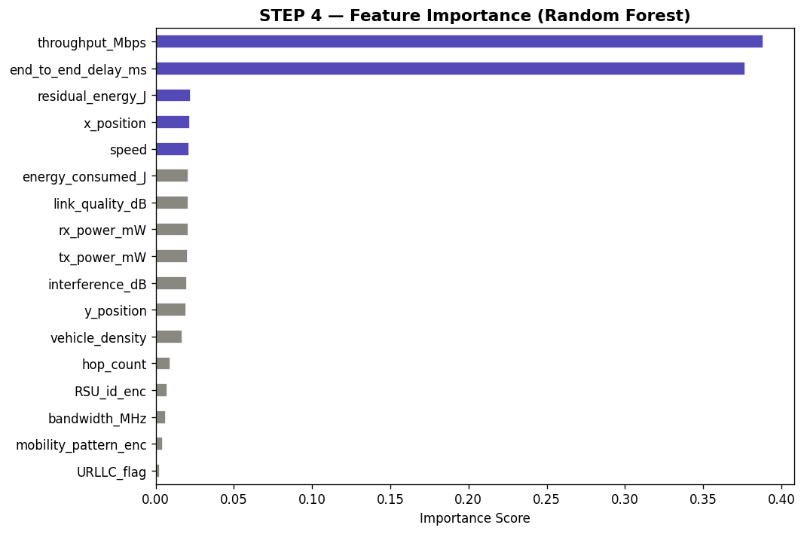
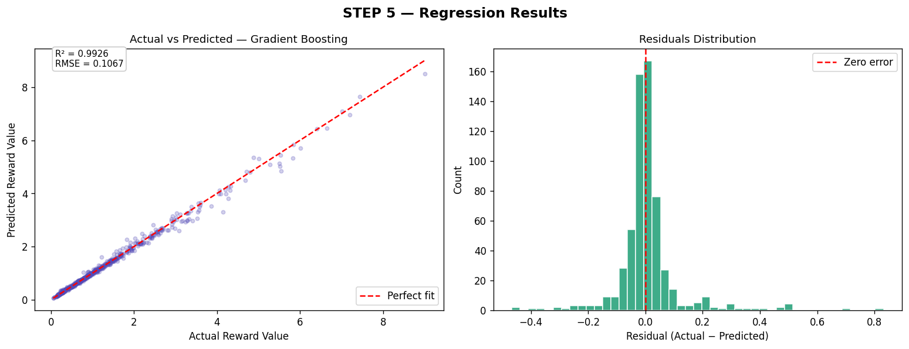
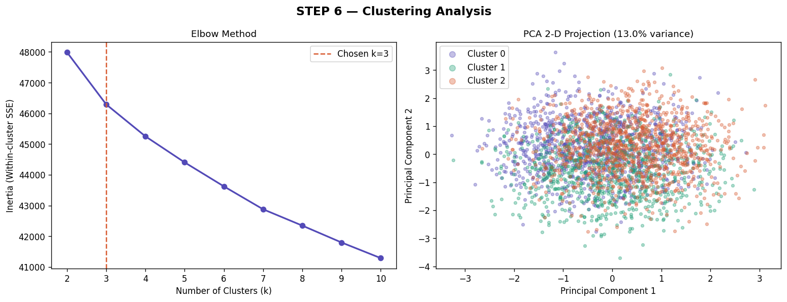
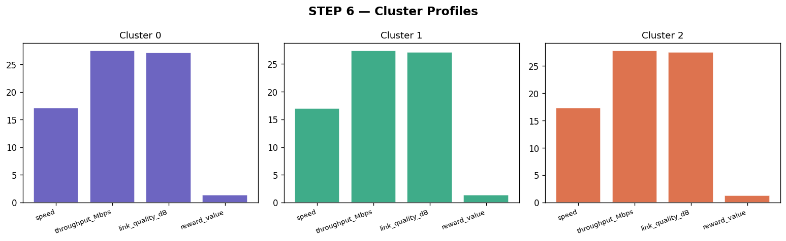
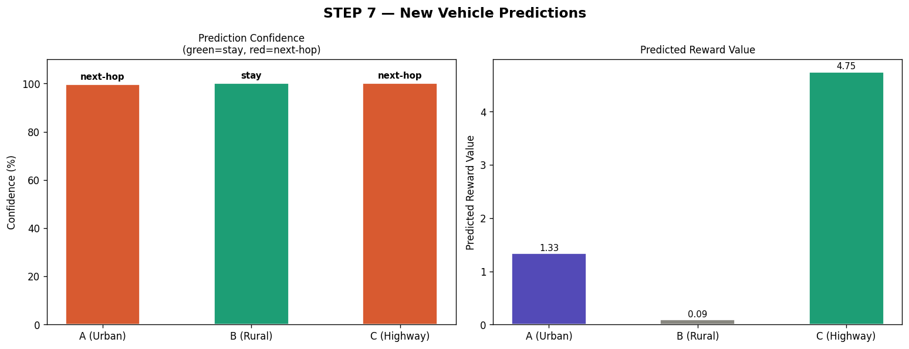

# 🚗 AI-Driven Vehicle Network Optimization  
### *(VANET Machine Learning Project)*

---

## 📌 Overview

This project implements a complete **end-to-end Machine Learning pipeline** on a **Vehicular Ad Hoc Network (VANET)** dataset. It simulates intelligent decision-making in next-generation **5G-enabled vehicle communication systems**.

The system leverages **classification, regression, and clustering models** to optimize routing decisions, predict network rewards, and analyze vehicle behavior patterns.

---

## 🎯 Objectives

- 🚦 Predict optimal routing decisions (`next-hop` vs `stay`)
- 📉 Estimate network performance rewards
- 🚗 Analyze and group vehicle behavior using clustering
- 🧠 Build a robust and generalizable ML pipeline

---

## 📊 Dataset

- **Size:** 3000 rows × 23 features  
- **Domain:** 5G Vehicular Network Simulation  
- **Key Features:**
  - Vehicle speed & density  
  - Signal strength & bandwidth  
  - Network delay & interference  
  - Mobility patterns (urban / rural / highway)  
  - Energy consumption & routing stability  

---

## ⚙️ Project Pipeline

---

### 🔍 1. Exploratory Data Analysis (EDA)

- Feature distribution analysis  
- Categorical feature insights  
- Correlation heatmap  
- Boxplots for relationships  

📁 **Outputs:**

  
  
  


---

### 🧹 2. Data Preprocessing

- Label Encoding for categorical variables  
- Feature scaling using **StandardScaler**  
- Train-Test Split (**80:20**)  

---

### 🤖 3. Classification (Routing Decision)

**Goal:** Predict optimal routing action

Models Used:
- 🌲 Random Forest (**Best Performer**)  
- 🌳 Decision Tree  
- 📈 Logistic Regression  

📊 **Evaluation Metrics:**
- Accuracy Score  
- 5-Fold Cross Validation  
- Confusion Matrix  

📁 **Outputs:**

  


---

### 📉 4. Regression (Reward Prediction)

**Goal:** Predict continuous reward values

Models Used:
- ⚡ Gradient Boosting (**Best Performer**)  
- 📊 Linear Regression  

📊 **Metrics:**
- R² Score  
- RMSE  
- MAE  

📁 **Output:**



---

### 🧠 5. Clustering (Vehicle Behavior Analysis)

- Algorithm: **K-Means**
- Optimal clusters: **k = 3**
- Dimensionality reduction using **PCA**

📊 **Insights:**
- Identified distinct groups of vehicle behavior patterns  

📁 **Outputs:**

  


---

### 🔮 6. Predictions on New Data

Tested on **unseen vehicle samples**

Predictions include:
- Routing decision  
- Confidence score  
- Expected reward  
- Cluster assignment  

📁 **Output:**



---

## 🧠 Key Insights

- ✅ Random Forest achieved the best classification performance  
- 📡 Signal strength & throughput are critical decision factors  
- 🚗 Clustering reveals distinct vehicle behavior groups  
- 🔄 Model generalizes well to unseen data  

---

## 🛠️ Tech Stack

- **Language:** Python 🐍  
- **Libraries:**
  - Pandas, NumPy  
  - Matplotlib, Seaborn  
  - Scikit-learn  

---

## ▶️ How to Run

```bash
# Clone the repository
git clone https://github.com/your-username/AI_5G_Vehicle_Network_ML_Project.git

# Navigate into project
cd AI_5G_Vehicle_Network_ML_Project

# Install dependencies
pip install pandas numpy matplotlib seaborn scikit-learn

# Run the project
python main.py
```

---

## 📁 Project Structure

```
AI_5G_Vehicle_Network_ML_Project/
│
├── main.py
├── Vehicle_dataset.csv
├── fig1_distributions.png
├── fig2_categoricals.png
├── fig3_correlation.png
├── fig4_boxplots.png
├── fig5_classification.png
├── fig6_feature_importance.png
├── fig7_regression.png
├── fig8_clustering.png
├── fig9_cluster_profiles.png
├── fig10_predictions.png
└── README.md
```

---

## 🚀 Future Enhancements

- 🌐 Deploy as a **Streamlit / Flask web app**  
- 📡 Integrate real-time vehicle data  
- 🤖 Apply Deep Learning models  
- 📶 Connect with 5G simulation frameworks  

---

## 👨‍💻 Author

**Shiva Kumar**  
B.Tech CSE | IIIT Vadodara  

---

## ⭐ Support

If you found this project useful, consider giving it a ⭐ on GitHub!
